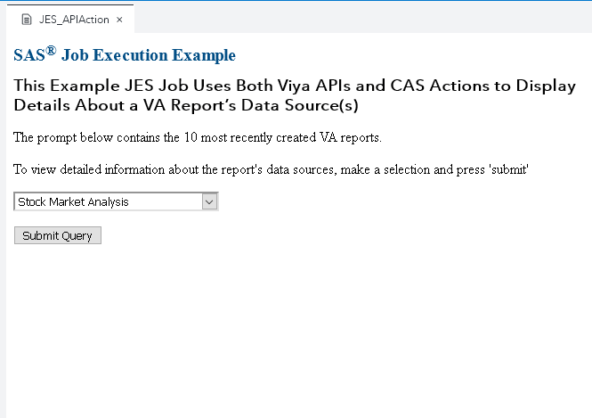

# Job Execution Service Example that utilizes Viya APIs and CAS Actions

One of the things I like best about creating applications in the [SAS Viya Job Execution Service](https://go.documentation.sas.com/?cdcId=jobexeccdc&cdcVersion=2.2&docsetId=jobexecug&docsetTarget=titlepage.htm&locale=en#p0izfftsr05kf6n1barcj6t2pxid) is the ability to leverage all of the goodies the Viya platform has to offer.   Developers can use the JES environment to make API calls to the SAS Viya services, utilize the powerful [CAS actions sets](https://go.documentation.sas.com/?docsetId=pgmdiff&docsetTarget=p06ibhzb2bklaon1a86ili3wpil9.htm&docsetVersion=3.5&locale=en) and even run [Viya procedures](https://go.documentation.sas.com/?docsetId=pgmdiff&docsetTarget=n16pcp93f99tsen11ks9rgnongpw.htm&docsetVersion=3.5&locale=en)!  This repository contains an example JES job which first prompts allows users to select a Visual Analytics Report from a dropdown list.  After a selection is made, the job uses API calls to retrieve a listing of the report's data sources and determine if those data sources are currently loaded into memory.  After this, the job runs a CAS action on each of the report data sources to retrieve its total columns, rows and even if the data was loaded into CAS using the compress option.

The following animation shows this example JES job in action:

This directory contains the resources that you need to recreate this example:

- A JSON file that contains the completed JES Job,
  `JES_APIAction.json`.

  A SAS administrator can import the job into a SAS Viya 3.5 (or later)
  environment using
  [these instructions](https://go.documentation.sas.com/?docsetId=calpromotion&docsetTarget=n0djzpossyj6rrn1vvi1wfvp2qhp.htm&docsetVersion=3.5&locale=en#p1h997oay4wsjon1uby6m99zzhsx).

- The JES job's SAS source code to create the ODS output,
  `JES_APIAction.sas`.
- The JES job's HTML code to create prompts and execute the job,
  `JES_APIAction.html`.

Save all the code in a SAS Job Execution Web Application 2.2 job definition
within a Viya 3.5 environment. The job must be executed with the parameter:
`_action=form,execute`.
