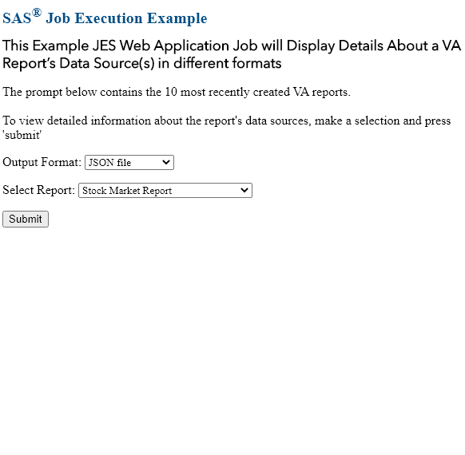

# Changing JES Web Application Outputs on the Fly

One common question I get about creating applications using the [Job Execution Service Web Application](https://go.documentation.sas.com/doc/en/jobexeccdc/2.2/jobexecug/titlepage.htm) is if the job's results can be delivered in a different format.  The most popular request is if a JSON file can be returned.  Well, as it turns out it's very easy to do this!  As a matter of fact the Job Execution Service Web Application's documentation has a [specific example](https://go.documentation.sas.com/doc/en/jobexeccdc/2.2/jobexecug/n0t91q5lsc2b8qn14fd0cgbmylr8.htm#n1946clxvisfs1n1evin42sckavo) which shows how to format a Job's results as a JSON file.

In this article, we will be building on [this example](https://github.com/sassoftware/sas-viya-programming/tree/master/communities/SAS/JES_ApiActionProc).  Specifically, we will add an additional prompt to the user interface asking the user if they would like to have the job's results returned as a JSON file or as a SAS ODS table.  If the user selects "JSON File" then we will use the concepts from the [documentation's example](https://go.documentation.sas.com/doc/en/jobexeccdc/2.2/jobexecug/n0t91q5lsc2b8qn14fd0cgbmylr8.htm#n1946clxvisfs1n1evin42sckavo) to return the job's output as a JSON file.  After the JSON file is returned, some basic formatting will be applied to convert the JSON file's contents into a simple bulleted list.

The completed application will look like this:

This directory contains the resources that you need to recreate this example:

- A JSON file that contains the completed JES Job,
  `JES_selectOutputFormat.json`.

  A SAS administrator can import the job into a SAS Viya 3.5 (or later)
  environment using
  [these instructions](https://go.documentation.sas.com/?docsetId=calpromotion&docsetTarget=n0djzpossyj6rrn1vvi1wfvp2qhp.htm&docsetVersion=3.5&locale=en#p1h997oay4wsjon1uby6m99zzhsx).

- The JES job's SAS source code to create the ODS output,
  `JES_selectOutputFormat.sas`.
- The JES job's HTML code to create prompts and execute the job,
  `JES_selectOutputFormat.html`.

Save all the code in a SAS Job Execution Web Application 2.2 job definition
within a Viya 3.5 environment. The job must be executed with the parameter:
`_action=form,execute`.
