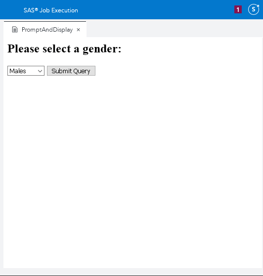

Version 2.2 of the [SAS Viya Job Execution Service](https://go.documentation.sas.com/?cdcId=jobexeccdc&cdcVersion=2.2&docsetId=jobexecug&docsetTarget=titlepage.htm&locale=en#p0izfftsr05kf6n1barcj6t2pxid) has some fantastic new features which can enable developers to create custom applications to meet specific reporting needs.  Specifically this version delivers the ability to store HTML input forms, prompts, and source code within a single job definition. When you copy or move a job, all these elements move with it.

The example in this folder demonstrates the use of javascript interact with the JES service.  First, the user selects either "Males" or "Females" from the drop down.  Javascript is then used to submit the form's selection using the POST method.  The JES job then receives the selected value and leverages it as a macro in the SAS code stored within the job's definition and the output is then displayed in a DIV element.

The animation below shows this example JES job in action:

This directory contains the needed resources to recreate this example including:

* A JSON file containing the completed JES Job - executingJESUsingJavaScript.json
    * A SAS Administrator can import into a SAS Viya 3.5 (or later) environment using [these instructions](https://go.documentation.sas.com/?docsetId=calpromotion&docsetTarget=n0djzpossyj6rrn1vvi1wfvp2qhp.htm&docsetVersion=3.5&locale=en#p1h997oay4wsjon1uby6m99zzhsx)
* The JES job's SAS source code to create the ODS output - executingJESUsingJavaScript.sas
* The JES job's HTML code to create prompts and execute the job - executingJESUsingJavaScript.html

All code intended to be saved in a SAS® Job Execution Web Application 2.2 job definition within a Viya 3.5 environment. 
The job must be executed with the parameter: _action=form,execute

